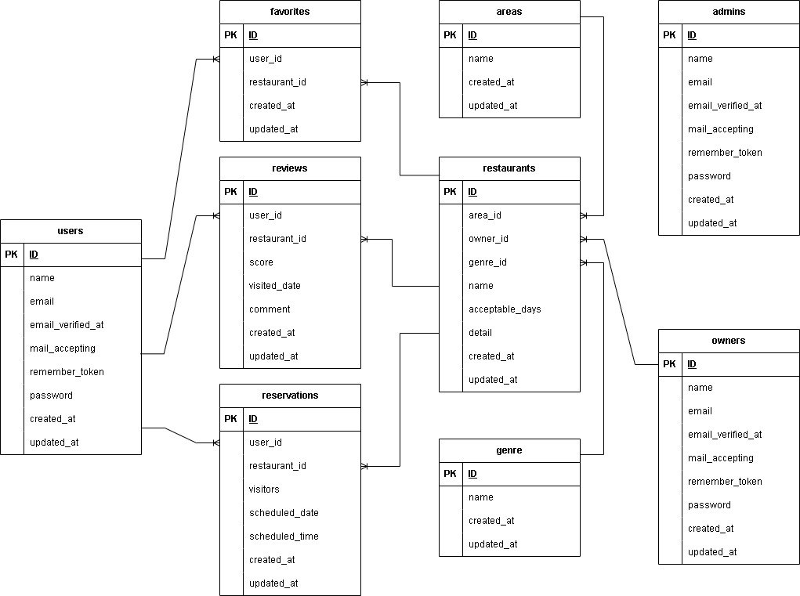

# Rese(レストラン予約システム)

> **[本記事の対象となるユーザ]**  
windowsの基本的なコマンドを使用したことがある  
ubuntu linuxの基本的な知識、コマンドが理解できる  
docker(docker-compose)にてコンテナを作成、使用したことがある  

> **[実施した環境]**  
Windows10 pro(上のwsl2)  
docker v4.28.0  
UBUNTU Linux 22.04.3 LTS  
テキストエディタ: vscode  
※上記以外の環境をご使用の方は各々の環境次第で適宜対応をお願いします  

<br><br><br><br><hr>

### <環境構築>

**1.プロジェクトを展開するディレクトリ上でgit clone実施**

~~~
git clone git@github.com:dbymmt/assignment2_on_restaurants_reservation.git
~~~

カレントディレクトリに「assignment2_on_restaurants_reservation」が作成され配下に以下が作成される
- docker(ディレクトリ)
- src(ディレクトリ)
- docker-compose.yml(ファイル)

※「assignment2_on_restaurants_reservation」という名前について
必要であれば適宜mvコマンド等で名前を変更してください。
以後ディレクトリ名「assignment2_on_restaurants_reservation」を前提に話を進めます。
<br>

**2.ディレクトリ「assignment2_onrestaurants_reservation」に移動**

~~~
cd assignment2_on_restaurants_reservation
~~~
※リネームしている場合はそのリネームしたディレクトリに移動します。
<br>

**3.各dockerコンテナ起動**

~~~
docker-compose up -d --build
~~~
```docker ps``` コマンドにて4個のコンテナが起動していれば問題なし。
- phpmyadmin
- php
- nginx
- mysql
<br>

**4.環境ファイルの作成、編集**

~~~
cp .env.example .env
~~~
.envファイルが作成されたことを確認する
※手順6.にてこのファイルを変更するので作成されたことは必ず確認してください。
<br>

**5.vscodeの起動**
~~~
code .
~~~
※ここから先でコマンド入力するときvscode上のターミナルから実行すると対応が容易になります。
<br>

**6. .envの編集**
<br>
以下項目を以下の通り変更する

~~~
DB_CONNECTION=mysql
DB_HOST=mysql
DB_PORT=3306
DB_DATABASE=laravel_db
DB_USERNAME=laravel_user
DB_PASSWORD=laravel_pass
~~~

※データベース名、ユーザ名、パスワードを任意のものに変更したい場合  
docker-compose.ymlファイルのmysqlディレクティブにて  
　データベース名→MYSQL_DATABASE:  
　ユーザ名→MYSQL_USER:  
　パスワード→MYSQL_PASSWORD:  
をそれぞれ編集したうえで.envの該当箇所をその任意のものに変更してください  
<br>

**7.「php」コンテナに入る**

~~~
docker-compose exec php bash
~~~
そのコンテナに対応するプロンプトに変更される
<br>

**8.laravelインストール**

~~~
composer install
~~~
インストールが完了することを確認する
<br>

**9.鍵の作成**

~~~
php artisan key:generate
~~~
成功したことを確認する
<br>

**10.各テーブル、テストデータ作成**

~~~
php artisan migrate:fresh --seed
~~~
成功したことを確認する
<br>

**11.storage/app/publicフォルダの使用宣言**

~~~
php artisan storage:link
~~~
publicディレクトリの下に「storage」リンクが作成される
<br>

**12.画像用ディレクトリ作成**

~~~
mkdir storage/app/public/images
~~~
ディレクトリが作成されたことを確認する
<br>

**13.必要な画像をダウンロードし「images」ディレクトリに移動**

以下コマンドを逐次実施する

~~~
curl -OL https://coachtech-matter.s3-ap-northeast-1.amazonaws.com/image/sushi.jpg && mv sushi.jpg storage/app/public/images
~~~

~~~
curl -OL https://coachtech-matter.s3-ap-northeast-1.amazonaws.com/image/izakaya.jpg && mv izakaya.jpg storage/app/public/images
~~~

~~~
curl -OL https://coachtech-matter.s3-ap-northeast-1.amazonaws.com/image/yakiniku.jpg && mv yakiniku.jpg storage/app/public/images
~~~

~~~
curl -OL https://coachtech-matter.s3-ap-northeast-1.amazonaws.com/image/italian.jpg && mv italian.jpg storage/app/public/images
~~~

~~~
curl -OL https://coachtech-matter.s3-ap-northeast-1.amazonaws.com/image/ramen.jpg && mv ramen.jpg storage/app/public/images
~~~

「images」フォルダにsushi.jpg, izakaya.jpg, yakiniku.jpg, italian.jpg, ramen.jpgが作成される

<br>

**以上すべての手順で問題がなければ以下リンクで店舗一覧が表示されているはずです**
<br>
http://localhost/
<br><hr>

### <ER図>

